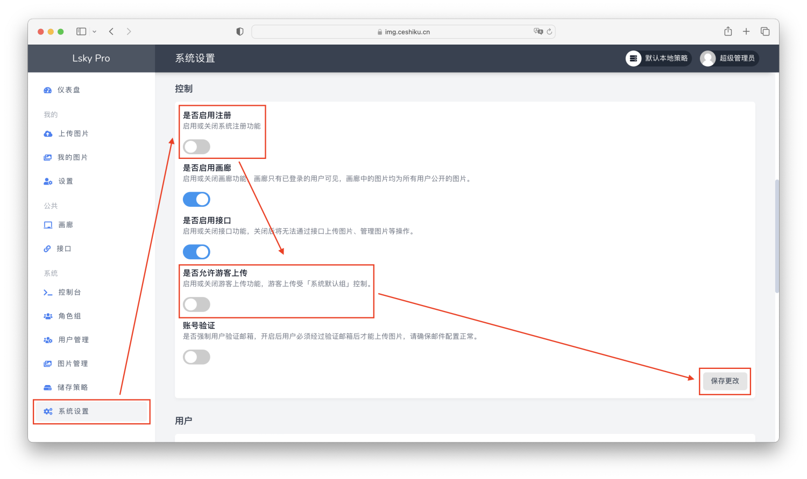
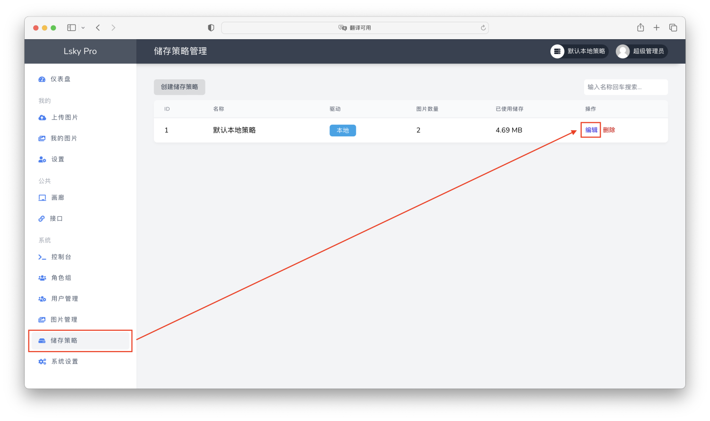
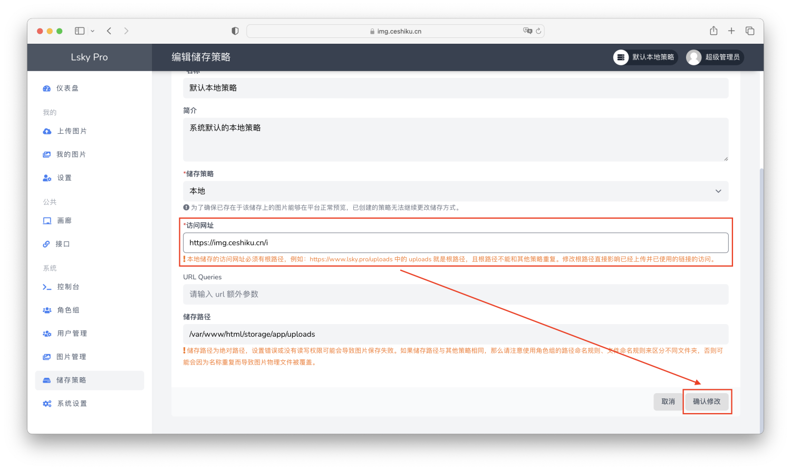

# 兰空图床搭建
:::info

兰空图床是一个图床服务

:::

## docker安装


```bash showLineNumbers
sudo docker run -d \
    --name lsky-pro \
    --restart unless-stopped \
    -p 8089:8089 \
    -v $PWD/lsky/web:/var/www/html \
    -e WEB_PORT=8089 \
    halcyonazure/lsky-pro-docker:latest
```
## Nginx反代https
配置文件如下:

```nginx showLineNumbers
ser www-data;
worker_processes auto;
pid /run/nginx.pid;
include /etc/nginx/modules-enabled/*.conf;

events {
    worker_connections 1024;
}

http {
    sendfile on;
    tcp_nopush on;
    tcp_nodelay on;
    keepalive_timeout 65;
    types_hash_max_size 4096;
    # 允许上传最大 20mb 的文件
    client_max_body_size 20m;

    include /etc/nginx/mime.types;
    default_type application/octet-stream;
    gzip on;

    server {
        listen 443 ssl;

        server_name yourdomain;
        ssl_certificate yourpem_path;
        ssl_certificate_key yourkey_path;

        ssl_session_timeout 1d;
        ssl_session_cache shared:MozSSL:10m;
        ssl_session_tickets off;
        ssl_protocols TLSv1.2;
        ssl_prefer_server_ciphers off;

        location / {
            proxy_pass http://127.0.0.1:8089;
            proxy_set_header Host $host;
            proxy_set_header X-Real-IP $remote_addr;
            proxy_set_header X-Forwarded-For $proxy_add_x_forwarded_for;
            proxy_set_header REMOTE-HOST $remote_addr;
						proxy_set_header X-Forwarded-Proto https;
            add_header X-Cache $upstream_cache_status;
				}
		}
    server {
        listen 80;
        location /.well-known/ {
               root /var/www/html;
            }
        location / {
                rewrite ^(.*)$ https://$host$1 permanent;
            }
    }
}
```

## 图床基础配置
1. 关闭访客注册、上传：
   
2. 配置域名：
   
   

## 参考
1. https://github.com/HalcyonAzure/lsky-pro-docker
2. https://senjianlu.com/2023/01/centos7-docker-lsky-pro-upic/