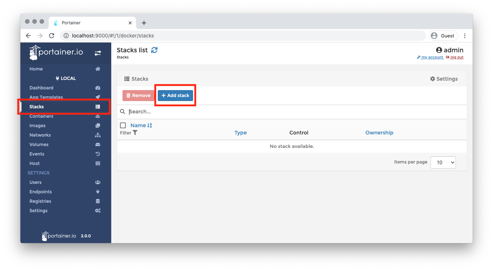
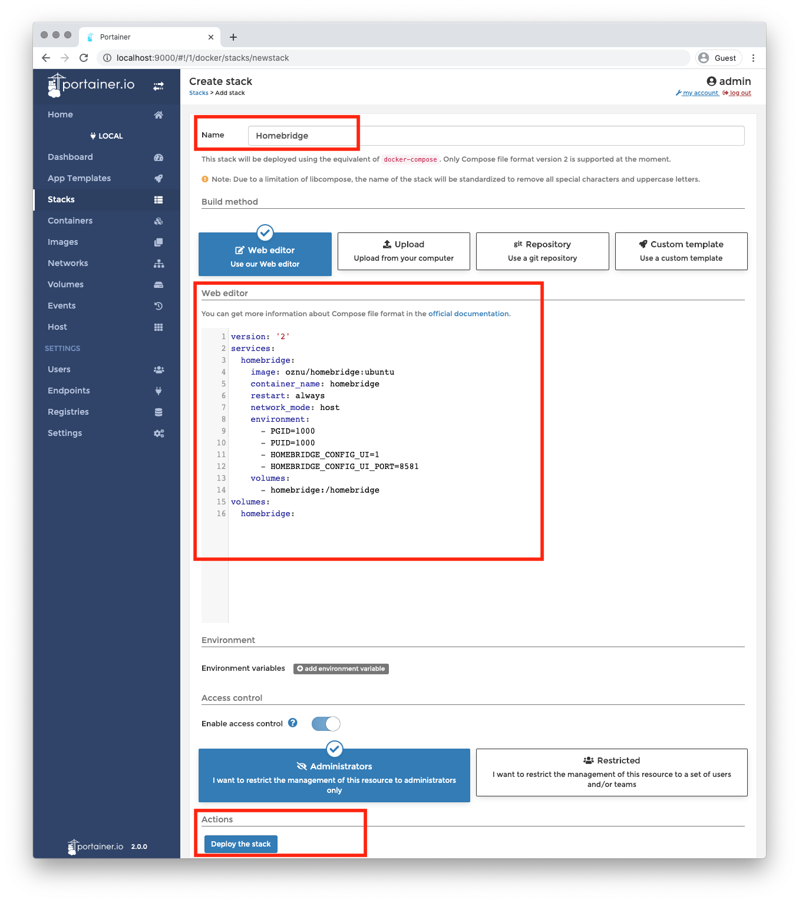

import MacCode from "@site/src/components/MacCode";
import Tabs from "@theme/Tabs";
import TabItem from "@theme/TabItem";

# Docker 安装 Homebridge

:::info
Docker-Homebridge Github 页面:[docker-homebridge](https://github.com/oznu/docker-homebridge)
:::

## 使用 Portainer 安装 Homebridge

1. 创建堆栈

   

2. 给堆栈命名，并在 Web Editor 中输入以下内容

```mdx-code-block
<MacCode>
```

<Tabs>
  <TabItem value="3" label="version 3" default>

```yaml showLineNumbers
version: "3"
services:
  homebridge:
    image: oznu/homebridge:ubuntu
    container_name: homebridge
    restart: always
    network_mode: host
    environment:
      - HOMEBRIDGE_CONFIG_UI_PORT=8581
    volumes:
      - homebridge:/homebridge
volumes:
  homebridge:
    external: true
```

  </TabItem>
  <TabItem value="2" label="version 2">

```yaml showLineNumbers
version: "2"
services:
  homebridge:
    image: oznu/homebridge:ubuntu
    container_name: homebridge
    restart: always
    network_mode: host
    environment:
      - HOMEBRIDGE_CONFIG_UI_PORT=8581
    volumes:
      - homebridge:/homebridge
volumes:
  homebridge:
```

  </TabItem>
</Tabs>

```mdx-code-block
</MacCode>
```

3. 点击部署堆栈

   

4. 等待部署完成后，浏览器进入http://192.168.*.*:8581（*为你的盒子的ip地址）
