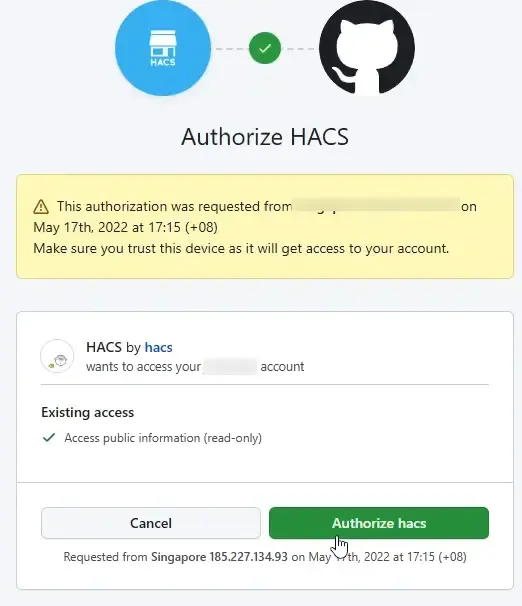

import MacCode from "@site/src/components/MacCode";

# HASS 安装 HACS

:::info

[HACS 官网](https://hacs.xyz/)

[HACS 极速版 官网](https://gitee.com/hacs-china)（推荐，国内安装插件快）

:::

## 手动安装

1. 在/usr/share/hassio/homeassistant/ （hass 的 config 的映射目录）下新建两个目录

```mdx-code-block
<MacCode>
```

```bash showLineNumbers
cd  /usr/share/hassio/homeassistant/
mkdir custom_components
mkdir www
```

```mdx-code-block
</MacCode>
```

2. 通过 https://github.com/hacs/integration/releases/ 下载离线包，解压后将 hacs 文件夹通过 FTP 软件拷贝至/usr/share/Hassio/homeassistant/custom_components

## 脚本安装

在 HASS 终端输入

```mdx-code-block
<MacCode>
```

```bash showLineNumbers
wget -O - https://get.hacs.xyz | bash -
```

```mdx-code-block
</MacCode>
```

## 配置 HACS

1. 在后台界面选择“配置”-“系统”，右上角点击“重新启动”。

2. 重启后，在“配置”-“设备与服务”中添加集成。


3. 此界面全部勾选，点提交。


4. 复制下方代码，打开上面的 Github 链接。（如果没有 Github 账号就注册一个）


5. 在弹出的页面粘贴代码


6. 点击 Authorize hacs 即可



7. 回到之前页面，等待片刻，HACS 安装完成，此时，左边栏就会出现 HACS 的选项


