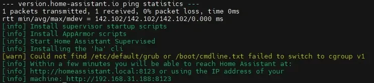

import MacCode from "@site/src/components/MacCode";

# 安装 Homeassitant Supervisor

## Docker 安装

```mdx-code-block
<MacCode>
```

```bash showLineNumbers
docker run -d --name hassio_supervisor --privileged \
-v /var/run/docker.sock:/var/run/docker.sock \
-v /var/run/dbus:/var/run/dbus \
-v /opt/docker/hassio:/data \
-e SUPERVISOR_SHARE="/opt/docker/hassio" \
-e SUPERVISOR_NAME=hassio_supervisor \
-e HOMEASSISTANT_REPOSITORY="homeassistant/qemuarm-64-homeassistant" \
--restart unless-stopped homeassistant/aarch64-hassio-supervisor:latest
```

```mdx-code-block
</MacCode>
```

:::tip
解决安装后提示系统不健康，导致不能备份，不能恢复备份，不能正常安装插件的问题！！！

```bash showLineNumbers
nano /opt/docker/hassio/jobs.json
# 这个目录是hassio的data目录映射的目录，根据实际情况而定
```

在 jobs.json 文件中添加以下内容

```json showLineNumbers
{ "ignore_conditions": ["healthy"] }
```

:::

## 官方脚本安装（Debian11 bullseye）

:::caution
注意这个会重置你的 docker
:::

1. 准备工作

```mdx-code-block
<MacCode>
```

```bash showLineNumbers
sudo -i
apt update && sudo apt upgrade -y && sudo apt autoremove -y
apt --fix-broken install
apt-get install jq curl avahi-daemon apparmor-utils udisks2 libglib2.0-bin network-manager dbus wget -y
```

```mdx-code-block
</MacCode>
```

2. 安装 OS agent

:::info
Supervisor 通过 OS agent 对接操作系统，官方已经强制要求。（截止本文发布，最新版本为 1.2.2，可参考 https://github.com/home-assistant/os-agent/releases 来获取最新版本链接，n1 为 aarch64 版本）
:::

```mdx-code-block
<MacCode>
```

```bash showLineNumbers
wget https://github.com/home-assistant/os-agent/releases/download/1.2.2/os-agent_1.2.2_linux_aarch64.deb
dpkg -i os-agent_1.2.2_linux_aarch64.deb
```

```mdx-code-block
</MacCode>
```

3. 安装 Home Assistant Supervised

```mdx-code-block
<MacCode>
```

```bash showLineNumbers
sudo -i
wget https://github.com/home-assistant/supervised-installer/releases/latest/download/homeassistant-supervised.deb
dpkg -i homeassistant-supervised.deb
```

```mdx-code-block
</MacCode>
```

一会儿会出现以下选择架构界面，方向键选择 qemuarm-64，按回车确认。


一段时间后出现以下画面，代表安装完成。



此时还在后台安装，等待几分钟（有可能几个小时）之后，在浏览器输入http://192.168.*.*:8123 （\*为你的盒子的 ip 地址）即可进入后台。此时正在初始化（如下图），耐心等待 5-10 分钟后，显示创建账户画面，即安装完成！


## 小米插件 Github

1. [hass-xiaomi-miot](https://github.com/al-one/hass-xiaomi-miot)
2. [xiaomi_miot_raw](https://github.com/ha0y/xiaomi_miot_raw)

## 参考

[n1 盒子安装官方 Home Assistant Supervised（原 HassIO）文字教程](https://www.bilibili.com/read/cv16695201)
