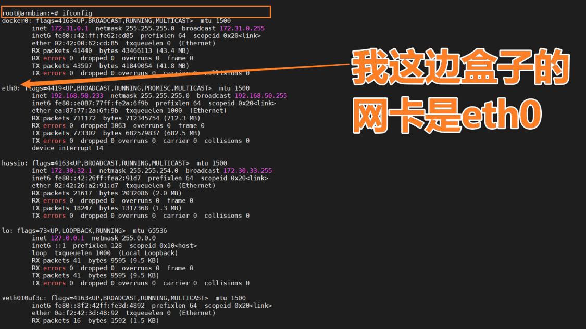
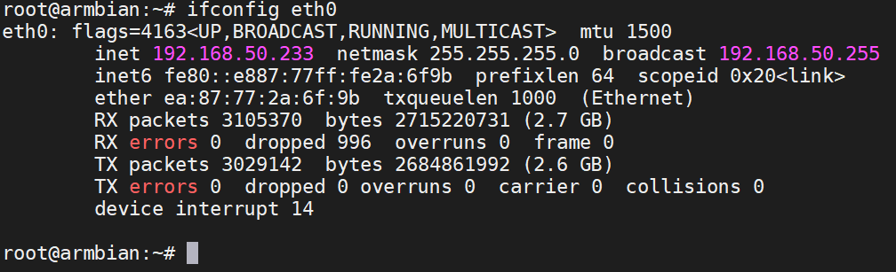
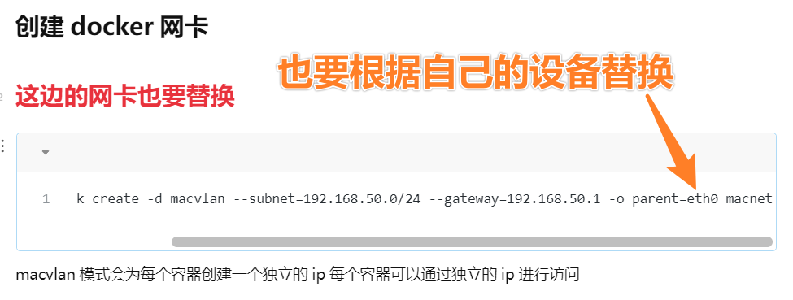
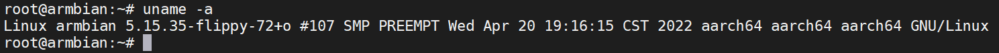
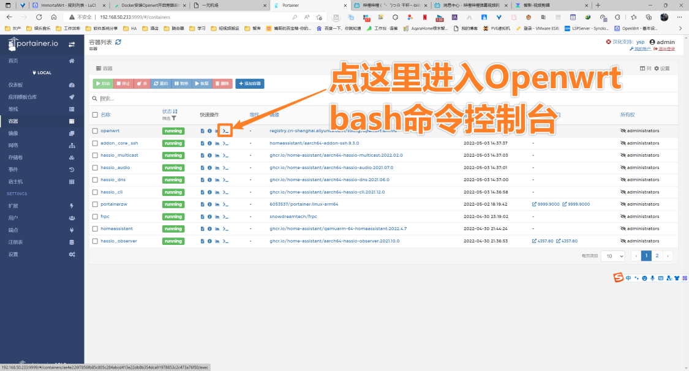
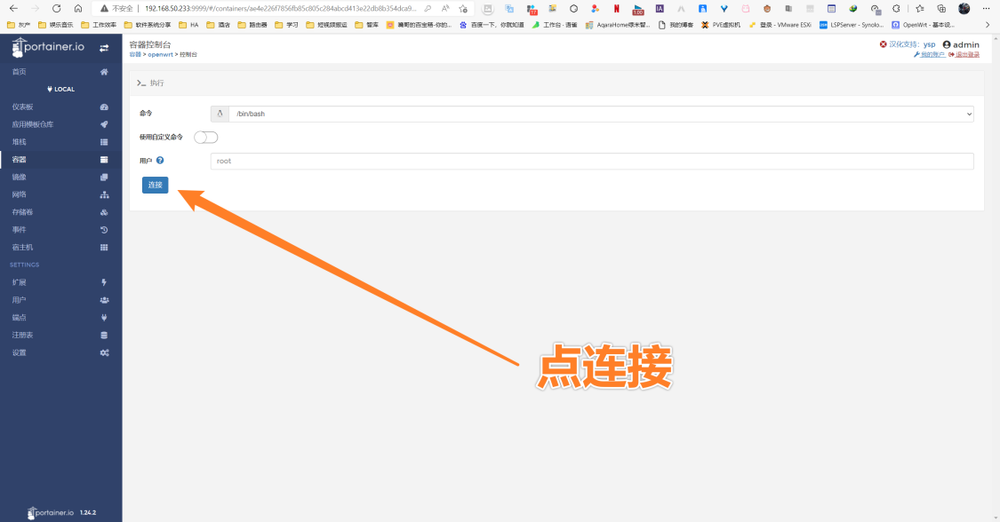
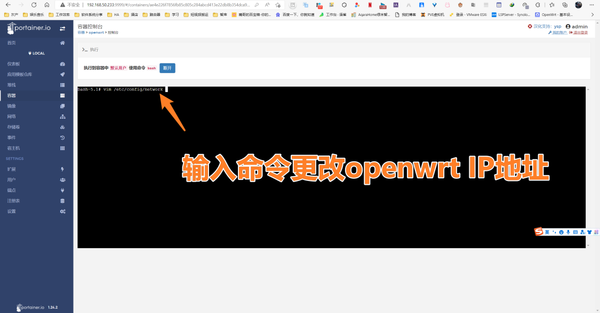
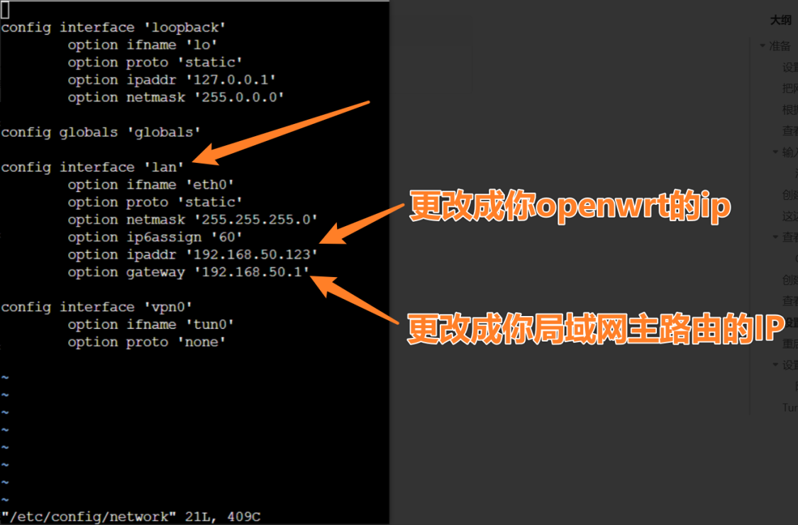
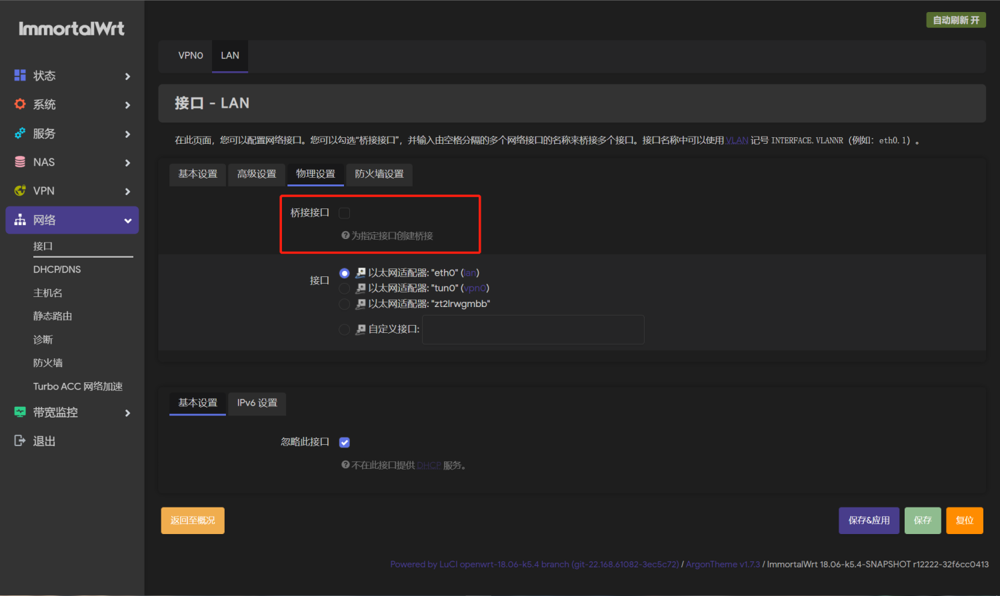

import MacCode from "@site/src/components/MacCode";

# Docker 安装 Openwrt

## 打开网卡混杂模式

:::tip

根据 IP 查看网卡!!!

打开网卡混杂模式后 openwrt 才能正确的收到数据

输入查看 ip 的命令 ifconfig 和 ip addr 两个命令差不多的取一个就行

:::

```mdx-code-block
<MacCode>
```

```bash showLineNumbers
ifconfig
```

```mdx-code-block
</MacCode>
```



```mdx-code-block
<MacCode>
```

```bash showLineNumbers
sudo ip link set 你自己的网卡名称 promisc on
##以下是我的网卡名称，每台设备可能不一样，要注意！！！！
sudo ip link set eth0 promisc on
```

```mdx-code-block
</MacCode>
```

没打开的状态如下图:



## 创建 docker 网卡

```mdx-code-block
<MacCode>
```

```bash showLineNumbers
docker network create -d macvlan --subnet=192.168.10.0/24 --gateway=192.168.10.1 -o parent=eth0 macnet
```

```mdx-code-block
</MacCode>
```

:::note
subnet&geteway&parent 根据自己的实际情况填写
:::



查看 Docker 网卡命令：

```mdx-code-block
<MacCode>
```

```bash showLineNumbers
docker network list
```

```mdx-code-block
</MacCode>
```

## 创建并启动 docker 镜像

OpenWrt 标准镜像

原项目地址：https://github.com/SuLingGG/OpenWrt-Docker

OpenWrt 标准镜像为集成常用软件包的 Docker 镜像，镜像自带软件包可满足大多数情景下的使用需求

| 支持设备/平台 | DockerHub               | 阿里云镜像仓库 (上海)                                   |
| ------------- | ----------------------- | ------------------------------------------------------- |
| arm8/aarch64  | sulinggg/openwrt:armv8  | registry.cn-shanghai.aliyuncs.com/suling/openwrt:armv8  |
| x86_64/amd64  | sulinggg/openwrt:x86_64 | registry.cn-shanghai.aliyuncs.com/suling/openwrt:x86_64 |

:::tip
查看自己的系统的架构:

```mdx-code-block
<MacCode>
```

```bash showLineNumbers
uname -a
```

```mdx-code-block
</MacCode>
```



:::

```mdx-code-block
<MacCode>
```

```bash showLineNumbers
docker run --restart always --name openwrt -d --network macnet --privileged registry.cn-shanghai.aliyuncs.com/suling/openwrt:armv8 /sbin/init
```

```mdx-code-block
</MacCode>
```

## 设置 Openwrt 容器 ip







```mdx-code-block
<MacCode>
```

```bash showLineNumbers
vim /etc/config/network
```

```mdx-code-block
</MacCode>
```



## 重启 Openwrt 网络

终端中输入：

```mdx-code-block
<MacCode>
```

```bash showLineNumbers
/etc/init.d/network restart
```

```mdx-code-block
</MacCode>
```

重启网络, 重启完成后便可以通过浏览器访问了
http://192.168.10.123
默认密码是 password

## 设置 openwrt

1. 取消桥接



2. 防火墙设置

防火墙添加以下命令并重启:

```mdx-code-block
<MacCode>
```

```bash showLineNumbers
iptables -t nat -I POSTROUTING -j MASQUERADE
```

```mdx-code-block
</MacCode>
```

3. Turbo ACC 网络加速设置

```mdx-code-block
<MacCode>
```

```bash showLineNumbers
114.114.114.114,114.114.115.115,223.5.5.5,223.6.6.6,180.76.76.76,119.29.29.29,119.28.28.28,1.2.4.8,210.2.4.8,8.8.8.8,8.8.4.4,1.1.1.1
```

```mdx-code-block
</MacCode>
```


